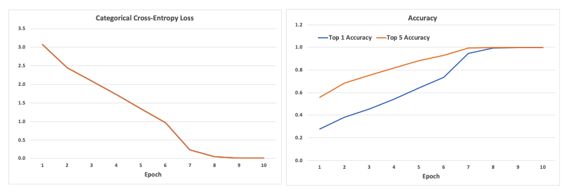

# MiniPlaces Challenge 
## Project Overview
The [MiniPlaces Challenge](https://github.com/CSAILVision/miniplaces) was introduced in a Computer Vision class at MIT. The goal of this project is to classify images into one of 100 scene categories (e.g. hotel, bridge, restaurant, etc).
## Dataset
The link for downloading the image data is [here](http://miniplaces.csail.mit.edu/data/data.tar.gz). The image database statistics is as follows:
```
  Training: 	100,000 images, with 1000 images per category
  Validation:	10,000 images, with 100 images per category
  Test:		10,000 images, with 100 images per category
```
The images have been resized to 128x128.

## Model Selection
For this project, I researched different [Keras Image Classification](https://keras.io/api/applications/) neural networks to use as a baseline model. I selected the [Xception](https://keras.io/api/applications/xception/) model. It was 88 MB, included 22,910,480 parameters, and had a Top-5 accuracy rate of 95% on the ImageNet dataset. The model is based on the [Xception: Deep Learning with Depthwise Separable Convolutions](https://arxiv.org/abs/1610.02357) paper. I selected this model because it had a good balance between complexity and accuracy. 

## Transfer Learning
My main idea was to start with a base Xception model in Keras that was pre-trained on the [ImageNet](http://www.image-net.org/) dataset. The base Xception model uses 299x299 sized images for 1000 classes. I customized the input layer for 128x128 sized images. I added two Dense layers and used the softmax activation function to classify the image into one of the 100 classes. I then initialized the base Xception model with pre-trained weights and my custom top layer with random weights. 

Transfer learning was done in 2 stages. In the first stage, the base Xception model parameters were frozen and only the top layer was trained using a bigger learning rate. Subsequently, all layers were trained using a finer learning rate. Some of these ideas are discussed [here](https://keras.io/guides/transfer_learning/)

## Model Training 
The training images were imported as batches of tensors using [ImageDataGenerator](https://keras.io/api/preprocessing/image/). I used a batch size of 128 images. Each input batch was of shape (128, 128, 128, 3) and each output batch was of shape (128, 100). Also plotted a few images to preview data. 

For stage 1 coarse training, the model was compiled with the Adam optimizer and a coarse learing rate (1e-3) using the categorical crossentropy loss function. The base model layers were set to non-trainable and only the custom top layer was trained. After 5 epochs, the trained model converged to a Top-1 accuracy of 64% and a Top-5 accuracy of 88%.

For stage 2 fine training, the model was compiled with the Adam optimizer and a finer learing rate (1e-4) using categorical crossentropy loss. All model parameters were set to be trainable. After 5 epochs, the fully trained model converged to a Top-1 and a Top-5 accuracy close to 100%.

The training notebook is [here](https://github.com/riasinha/miniplaces/blob/main/ria_xception_train.ipynb). Graphs below show loss and accuracy during epochs while training. 

## Model Test
After training my model, I tested it on the 10,000 validation samples using the notebook [here](https://github.com/riasinha/miniplaces/blob/main/ria_xception_test.ipynb). The validation set had a Top-1 accuracy of 41% and a Top-5 accuracy of 71%.  I used the model to output the Top-5 predictions of the 10,000 test samples. The final output file is [here](https://github.com/riasinha/miniplaces/blob/main/data/test.txt). 

## Conclusions
My deep neural network model was based on Xception with a custom top layer. Overall it included 128 layers and 23,062,156 parameters. I was able to train the model on 100,000 images in approximately 16 hours on a MacBook Pro (2.3 GHz 8-Core Intel Core i9, 32 GB 2667 MHz DDR4). 

The accuracy of the model on the training set was close to 100%. However, on the validation set, the Top-5 accuracy was 71%. The results suggested that there was overfitting during training. A bigger training set and/or a model that could use additional object annotations could improve accuracy.
